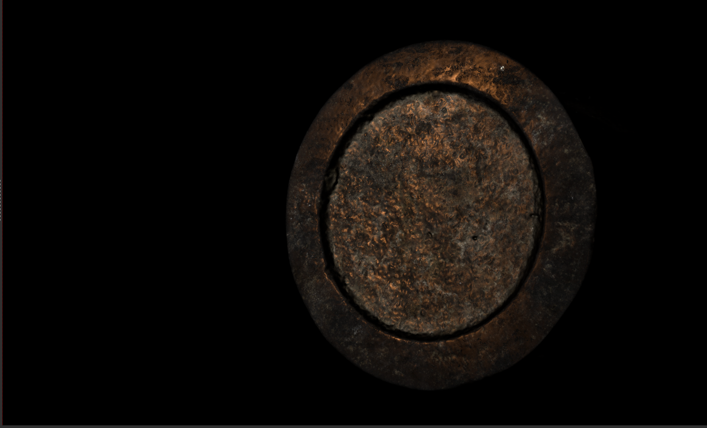
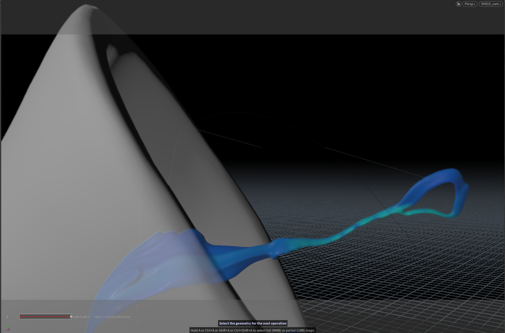
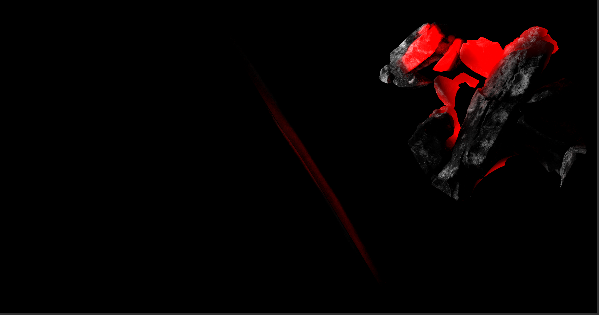
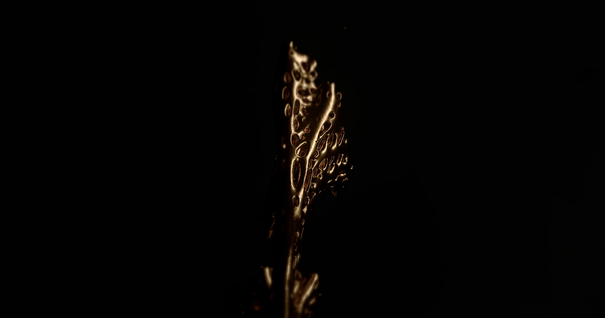

# House of Fireborn

**Material transformation, erosion and light — a visual process archive by Maison d’Atelier.**

The project follows metal through unstable states: branching gold, folded liquid, a fractured incandescent surface and a skull emerging from smoke. The visual problem is to keep those changes legible under narrow lighting, with most of the frame falling into black.

This archive starts with the exposed mechanics: gray geometry, blue diagnostic liquid, particles and intermediate renders. The finished images are the destination, not the whole story. Material comes from the supplied Fireborn process collection and its linked Houdini R&D folders, historically stored under `REEL01_Metamask`. Those shared folder names are retained in the [source manifest](docs/media-manifest.json).

## Visual references in the supplied collection

These supplied reference images place bright, hot material inside a dark working environment. They provide a useful visual comparison with the project’s incandescent interiors and narrow highlights. They are reference imagery, not Fireborn renders or documentation of a physical shoot. The pour filename names Dreamstime / Jatuporn79; attribution has not been independently verified.

A [second supplied foundry reference](media/images/reference-foundry-concept.jpg) is labeled as AI-generated in its original filename. It is retained as a reference only.

## 01 / Establishing the scene

The charcoal-pot playblast isolates the container, irregular fuel pieces and small particle activity before the final dark material treatment. The existing 93-frame AVI was reused; its matching JPG sequence was not rebuilt.

[Watch the charcoal playblast](media/video/charcoal-particle-playblast.mp4)

The disc and cone captures show how much of the form can be carried by a small highlight. The viewport view exposes the blue stream against the cone; the material study reduces the same kind of geometry to a narrow reflective edge.

[Triangle test: viscosity 0–1](media/video/triangle-viscosity-0-1.mp4) · [viscosity 1](media/video/triangle-viscosity-1.mp4) · [viscosity 2](media/video/triangle-viscosity-2.mp4) · [finer test](media/video/triangle-viscosity-2-finer-test.mp4)

These names come from the source files. The clips show different droplet and trailing shapes; they do not establish that one parameter alone caused every difference.

## 02 / Separating liquid from eroding geometry

Blue liquid over pale geometry makes the contact region readable. The companion erosion views remove that color separation and expose the changing skin. Front, top and back views matter because a plausible front silhouette can hide accumulation or loss of detail elsewhere.

[Liquid + geometry](media/video/liquid-and-erosion.mp4) · [erosion front](media/video/acid-erosion-front.mp4) · [top](media/video/acid-erosion-top.mp4) · [side](media/video/erosion-side-view.mp4) · [back contact](media/video/liquid-erosion-back.mp4)

The melt tests shift from a readable face to folds and softened features. The macro view makes the surface breakup visible; the frontal versions let the same problem be judged at portrait scale. These are retained as alternatives, not labeled as a proven sequence of fixes.

[Front melt v1](media/video/front-melt-v1.mp4) · [front melt v2](media/video/front-melt-v2.mp4) · [acid/front melt](media/video/acid-front-melt.mp4) · [macro melt](media/video/macro-melt.mp4) · [acid macro](media/video/acid-macro-melt.mp4)

## 03 / Camera distance and surface breakup

The two numbered playblast sequences inspect the changing surface at different distances. `PB_cam6` contains frames 39–121; `PB_HQ_cam17` contains 39–500, despite the latter files retaining a `PB_cam6_HQ` prefix. Both are preserved at their full available length.

[Camera 6 review](media/video/transformation-cam6.mp4) · [HQ camera 17 review](media/video/transformation-hq-cam17.mp4)

The small `psp0025` and `psp0025_erosionscale07x10` batches are only 11 frames each. They are useful as short surface comparisons, not complete simulations.

[Base fragment](media/video/erosion-psp0025.mp4) · [erosion-scale fragment](media/video/erosion-scale-07x10.mp4)

## 04 / Particles and smoke

Five dust passes retain the underlying surface while changing the visible particle trace. The red/orange points are easiest to inspect along the upper silhouette. Keeping all five short versions exposes the range of tests without filling the repository with hundreds of almost identical stills.

[v1](media/video/dust-particles-v1.mp4) · [v2](media/video/dust-particles-v2.mp4) · [v3](media/video/dust-particles-v3.mp4) · [v4](media/video/dust-particles-v4.mp4) · [v5](media/video/dust-particles-v5.mp4)

The smoke capture puts the volume in front of the render controls. A separate short gray-geometry test shows smoke at the head’s upper edge. It is a useful visibility check before the dense, dark final composition.

[Smoke test](media/video/acid-smoke-test.mp4)

## 05 / Intermediate lava renders

The `SC090 / SH010` renders retain the red interior, broken dark shell and surrounding scene. They are intermediate evidence: darker and less isolated than the final lava views. The complete camera-2 batch has 96 frames; the alternate camera-1 batch stops at frame 16.

[Camera 2 — complete available batch](media/video/lava-render-cam2.mp4) · [camera 1 — 16-frame fragment](media/video/lava-render-cam1-fragment.mp4)

## 06 / Final material and lighting

The final treatment uses reflections to describe the gold’s edges, then reverses that relationship in the lava: orange light comes from within a broken black crust. The geometry and diagnostic colors disappear into material, light and framing.

[Gold skull film](media/video/final-gold-skull.mp4) · [liquid gold](media/video/final-liquid-gold.mp4) · [lava front](media/video/final-lava-front.mp4) · [lava profile](media/video/final-lava-profile.mp4)

## Archive notes

- [All media, sizes and provenance](docs/media-index.md)
- [Sequence decisions and audit boundaries](docs/audit-notes.md)
- Original movies retain their source frame rates. New sequence reviews use 24 fps, inferred from adjacent playblasts; this is a review assumption, not recovered scene metadata.
- GIFs are short, lower-resolution previews. Linked MP4s contain the complete selected clips.
- The archive documents visible results and source naming. Solver settings, causal explanations and a strict production chronology are not inferred from filenames alone. No scene files were modified or included.
