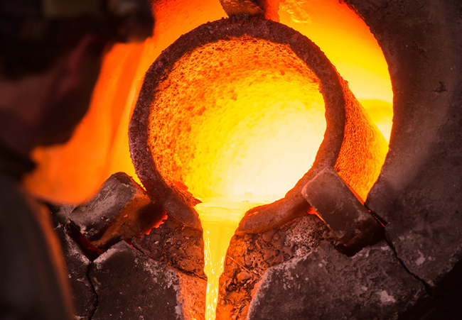
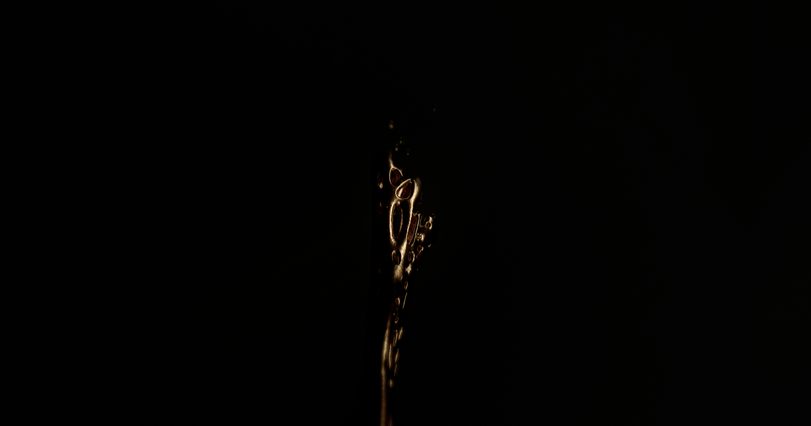
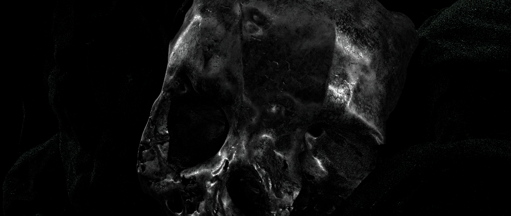
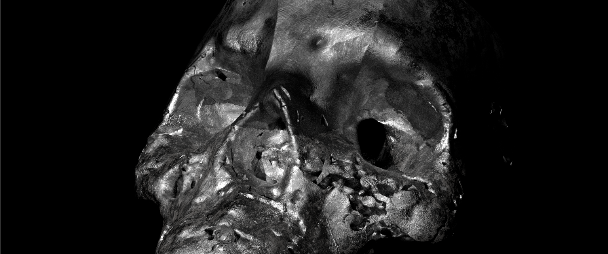
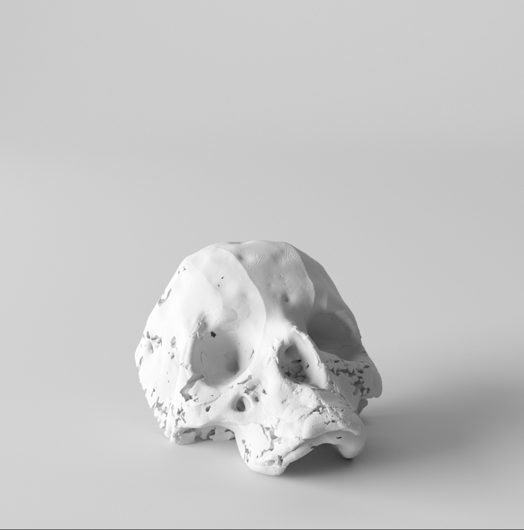
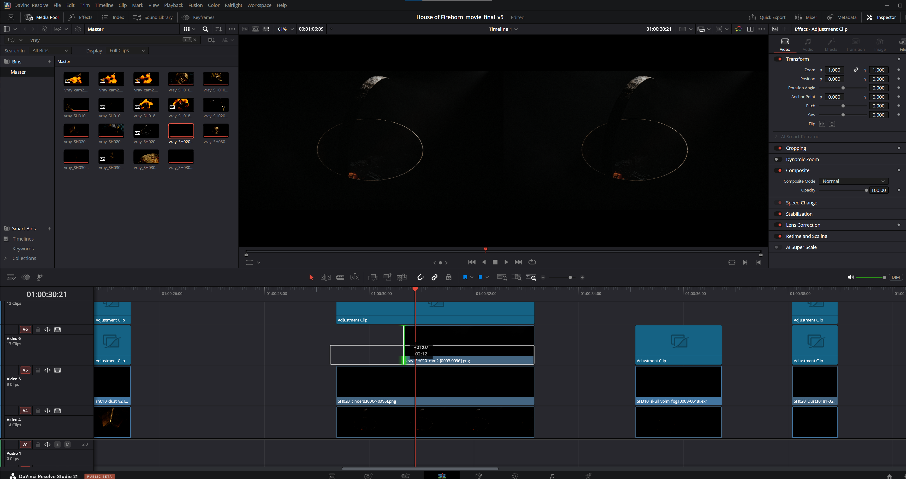
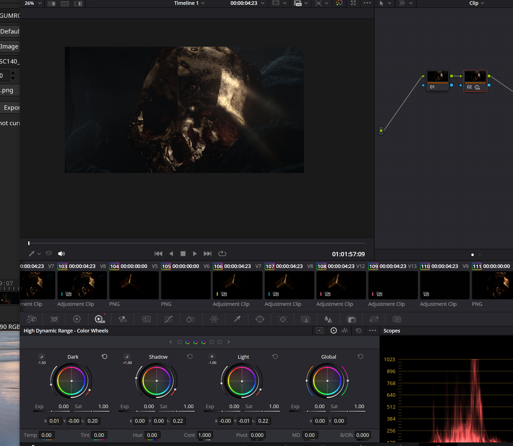
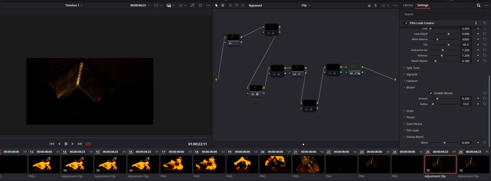

# House of Fireborn

**Simulation and look development in Houdini SideFX. Maison d’Atelier.**

## RBD Simulation in Houdini

**[▶ Watch the pot and breaking RBD charcoal — full playblast](media/video/charcoal-particle-playblast.mp4)**

The charcoal breakup carries the opening. Weight comes first; the RBD timing needs to sell the impact before the smaller fragments take over.

<table>
<tr><td width="50%"></td><td width="50%"></td></tr>
</table>

## References

<table>
<tr>
<td width="50%"></td>
<td width="50%"></td>
</tr>
<tr>
<td valign="top">Photograph: <a href="https://www.machinedesign.com/materials/article/21832007/cast-iron-and-wrought-iron-whats-the-difference" rel="nofollow">Jatuporn79 / Dreamstime, reproduced by Machine Design</a>.</td>
<td valign="top">Forging reference via <a href="https://i.pinimg.com/564x/7c/4c/3b/7c4c3b2222d3bab97a16f58c42c5c9fb.jpg" rel="nofollow">Pinterest</a>; original photographer and publication unverified.</td>
</tr>
</table>

Source: <a href="https://www.thegoldbullion.co.uk/what-is-smelting/" rel="nofollow">The Gold Bullion Company — What is Smelting?</a>

## 01 / Fluid Simulation in Houdini

The metal needs to feel heavy and almost reluctant to move. Viscosity is the main question here: how far can the motion stretch before it loses that weight?

<a href="media/video/triangle-viscosity-0-1.mp4">Triangle test: viscosity 0-1</a> · <a href="media/video/triangle-viscosity-1.mp4">viscosity 1</a> · <a href="media/video/triangle-viscosity-2.mp4">viscosity 2</a> · <a href="media/video/triangle-viscosity-2-finer-test.mp4">finer test</a>

## 02 / Erosion Tests

<a href="media/video/liquid-and-erosion.mp4">Liquid + geometry</a> · <a href="media/video/acid-erosion-front.mp4">erosion front</a> · <a href="media/video/acid-erosion-top.mp4">top</a> · <a href="media/video/erosion-side-view.mp4">side</a> · <a href="media/video/liquid-erosion-back.mp4">back contact</a>

<table>
<tr><td width="50%"></td><td width="50%"></td></tr>
<tr><td>Acid erosion</td><td>Acid front melt</td></tr>
<tr><td width="50%"></td><td width="50%"></td></tr>
<tr><td>Front melt</td><td>Viscous metal mask</td></tr>
</table>

Erosion sets the pace of the reveal. The liquid and breakup passes need to agree on that timing, especially in the macro shots.

<a href="media/video/front-melt-v1.mp4">Front melt v1</a> · <a href="media/video/front-melt-v2.mp4">front melt v2</a> · <a href="media/video/acid-front-melt.mp4">acid/front melt</a> · <a href="media/video/macro-melt.mp4">macro melt</a> · <a href="media/video/acid-macro-melt.mp4">acid macro</a>

<table>
<tr><td width="50%"></td><td width="50%"></td></tr>
<tr><td>Skull erosion study — 20 August 2024</td><td>Skull erosion study — 18 August 2024</td></tr>
</table>

## 03 / Camera Tests

Getting close makes the transformation feel physical. The frame needs enough room for the motion, but not so much that the tension disappears.

<a href="media/video/transformation-cam6.mp4">Camera 6 review</a> · <a href="media/video/transformation-hq-cam17.mp4">HQ camera 17 review</a>

<a href="media/video/erosion-psp0025.mp4">Base fragment</a> · <a href="media/video/erosion-scale-07x10.mp4">erosion-scale fragment</a>

## 04 / Particle and Smoke Simulation in Houdini

Particles should follow the action. Across these five passes, timing and density are the things to judge: the eye should stay on the transformation.

<a href="media/video/dust-particles-v1.mp4">v1</a> · <a href="media/video/dust-particles-v2.mp4">v2</a> · <a href="media/video/dust-particles-v3.mp4">v3</a> · <a href="media/video/dust-particles-v4.mp4">v4</a> · <a href="media/video/dust-particles-v5.mp4">v5</a>

The smoke gives the skull a slower beat. There is more tension when the face stays partly hidden.

<a href="media/video/acid-smoke-test.mp4">Smoke test</a>

## 05 / Charcoal Look Development

The heat needs somewhere dark to sit. The charcoal look depends on that contrast, without letting the glow flatten the surface.

<a href="media/video/lava-render-cam2.mp4">Camera 2 — complete available batch</a> · <a href="media/video/lava-render-cam1-fragment.mp4">camera 1 — 16-frame fragment</a>

## 06 / Shading and Lighting

<table>
<tr><td width="50%"></td><td width="50%"></td></tr>
<tr><td width="50%"></td><td width="50%"></td></tr>
</table>

<table>
<tr><td width="50%"></td><td width="50%"></td></tr>
<tr><td>Goldsmith flower closeup</td><td>Goldsmith mask</td></tr>
</table>

The appeal of the gold is in the falloff: a bright edge, then deep shadow. Lighting every surface would take away the intimacy of these shots.

<a href="media/video/final-gold-skull.mp4">Gold skull film</a> · <a href="media/video/final-liquid-gold.mp4">liquid gold</a> · <a href="media/video/final-lava-front.mp4">lava front</a> · <a href="media/video/final-lava-profile.mp4">lava profile</a>

## 07 / Color Correction

The grade brings the gold and charcoal into the same film. These Resolve passes include HDR adjustments and Film Look Creator tests, with attention on the highlights and depth of the blacks.

## Files

[Media](docs/media-index.md) · [Source notes](docs/media-manifest.json) · [Archive details](docs/audit-notes.md)

---

