# House of Fireborn

**RBD charcoal breakup, material transformation and light — a visual process archive by Maison d’Atelier.**

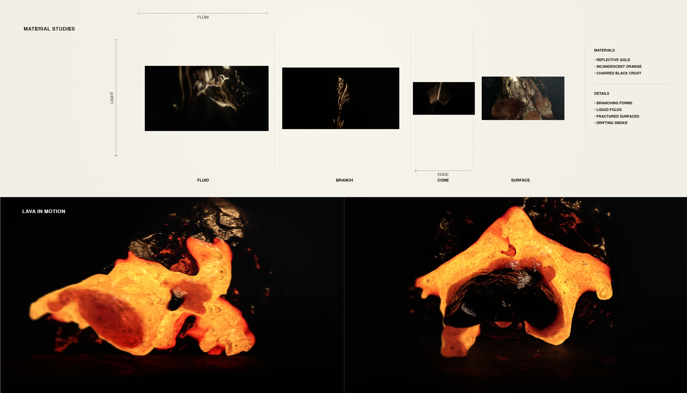

## Featured process / RBD charcoal breakup

[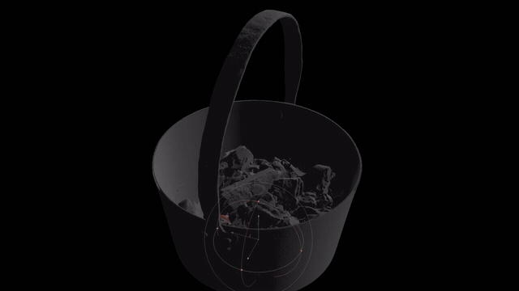](media/video/charcoal-particle-playblast.mp4)

**[▶ Watch the pot and breaking RBD charcoal — full playblast](media/video/charcoal-particle-playblast.mp4)**

The charcoal-pot test exposes the rigid-body breakup inside the container, with irregular charcoal pieces and small particle activity visible before the final dark material treatment. This is the featured process study for Fireborn. The complete existing 93-frame AVI is preserved as a web video at 24 fps; its matching JPG sequence was not rebuilt.

<table>
<tr><td width="50%">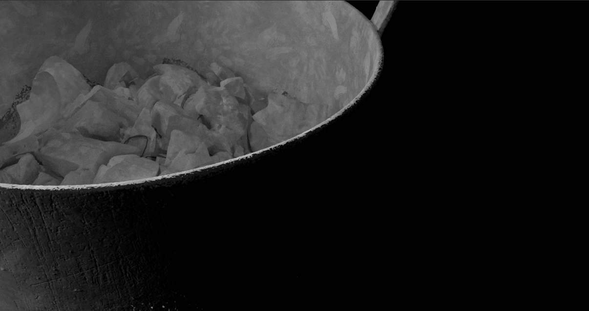</td><td width="50%">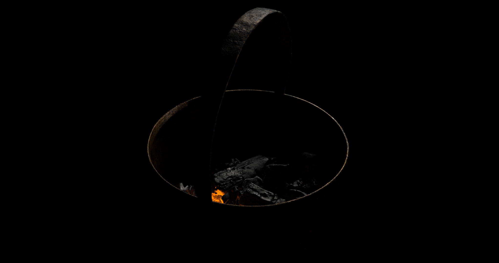</td></tr>
</table>

This archive starts with the exposed mechanics: gray geometry, blue diagnostic liquid, particles and intermediate renders. The finished images are the destination, not the whole story. Material comes from the supplied Fireborn process collection and its linked Houdini R&D folders, historically stored under `REEL01_Metamask`. Those shared folder names are retained in the [source manifest](docs/media-manifest.json).

## Inspiration / molten metal and forging

<table>
<tr>
<td width="50%">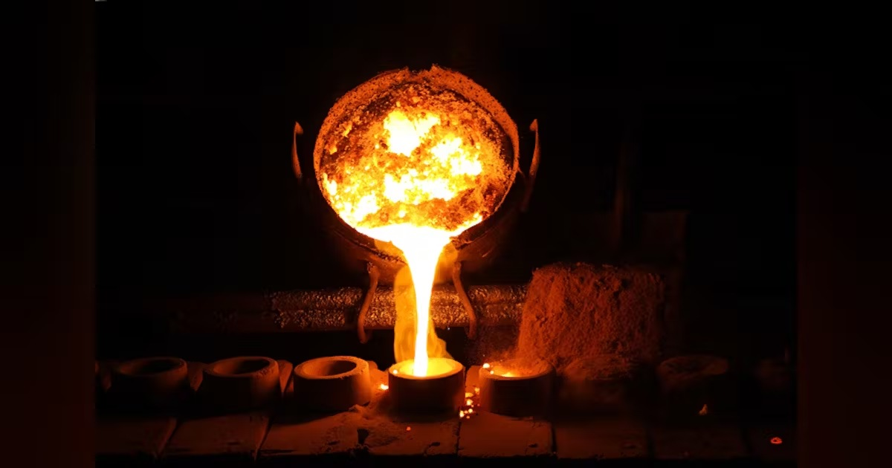</td>
<td width="50%">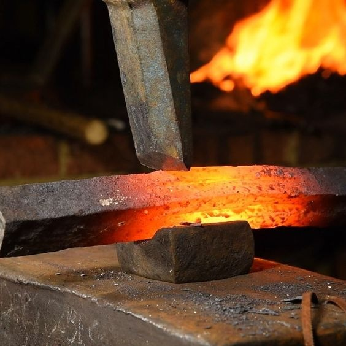</td>
</tr>
<tr>
<td valign="top">Molten-metal pour: bright liquid against a dark foundry. Photograph: <a href="https://www.machinedesign.com/materials/article/21832007/cast-iron-and-wrought-iron-whats-the-difference">Jatuporn79 / Dreamstime, reproduced by Machine Design</a>.</td>
<td valign="top">Forging: orange-hot metal, black scale and a rough surface. Retrieved via <a href="https://i.pinimg.com/564x/7c/4c/3b/7c4c3b2222d3bab97a16f58c42c5c9fb.jpg">Pinterest</a>; original photographer and publication unverified.</td>
</tr>
</table>

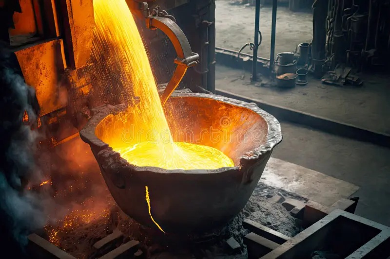

Foundry concept: glowing metal poured into a heavy vessel. Source: <a href="https://thumbs.dreamstime.com/b/br%C3%BBler-du-m%C3%A9tal-fondu-jaune-coulant-dans-une-grande-cuve-en-atelier-de-l-industrie-la-fonderie-cr%C3%A9%C3%A9-avec-ai-g%C3%A9n%C3%A9ratif-272049859.jpg">Dreamstime</a>, image 272049859. AI-generated illustration; contributor unverified.

These are external inspiration images, separate from the project’s simulations and renders. [Reference sources and attribution status](docs/references.md).

## 01 / Establishing the scene

The project follows metal through unstable states: branching gold, folded liquid, a fractured incandescent surface and a skull emerging from smoke. The visual problem is to keep those changes legible under narrow lighting, with most of the frame falling into black.

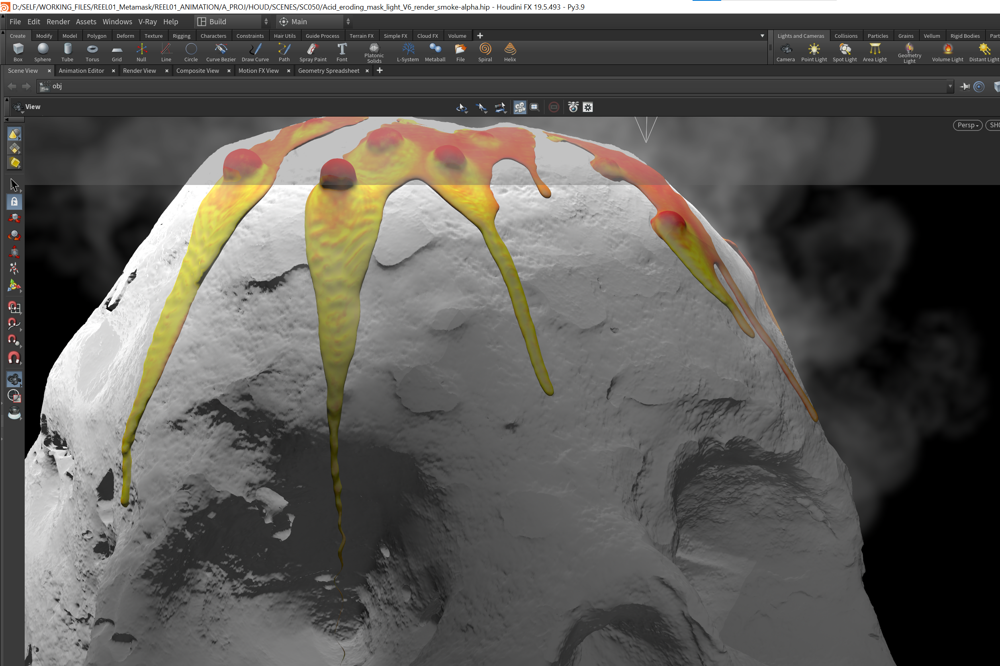

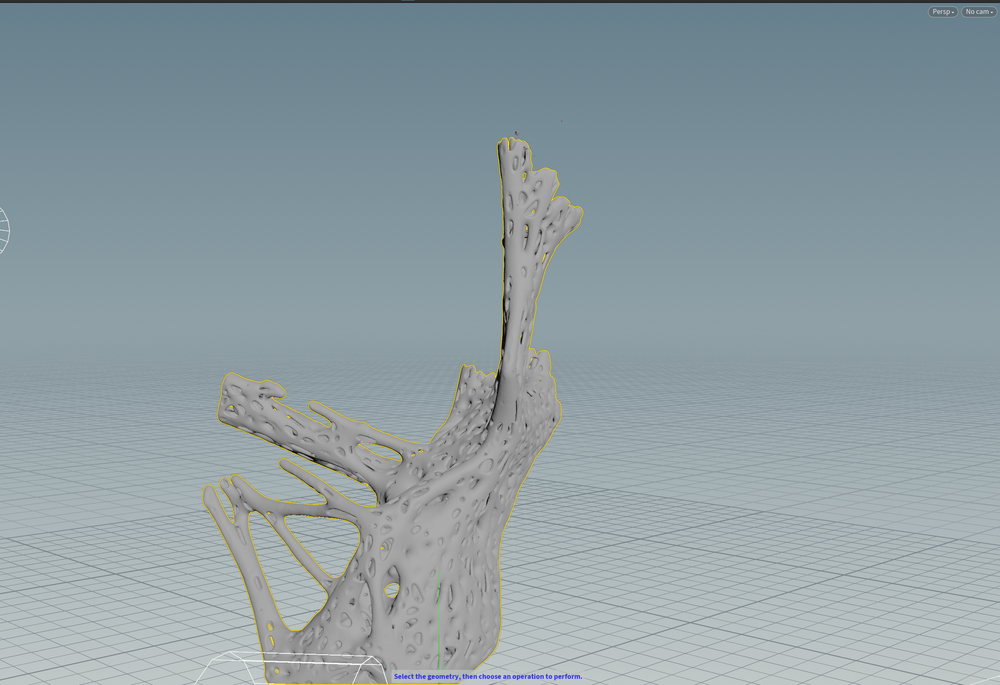

[Triangle test: viscosity 0–1](media/video/triangle-viscosity-0-1.mp4) · [viscosity 1](media/video/triangle-viscosity-1.mp4) · [viscosity 2](media/video/triangle-viscosity-2.mp4) · [finer test](media/video/triangle-viscosity-2-finer-test.mp4)

These names come from the source files. The clips show different droplet and trailing shapes; they do not establish that one parameter alone caused every difference.

## 02 / Separating liquid from eroding geometry

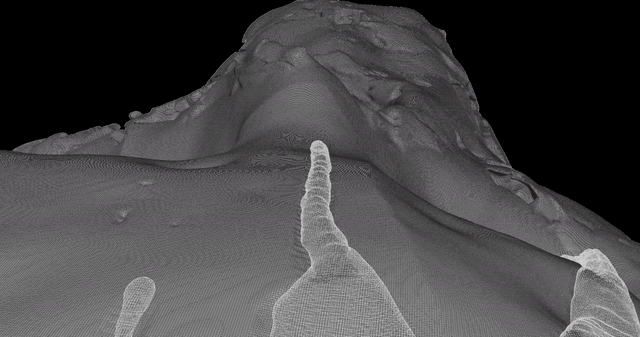

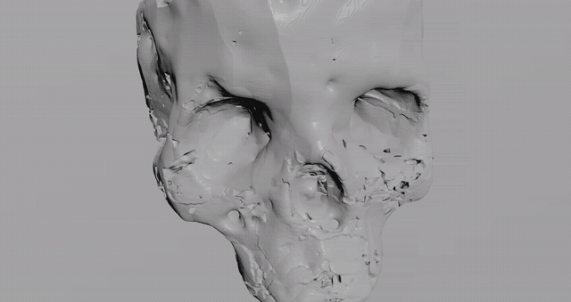

[Liquid + geometry](media/video/liquid-and-erosion.mp4) · [erosion front](media/video/acid-erosion-front.mp4) · [top](media/video/acid-erosion-top.mp4) · [side](media/video/erosion-side-view.mp4) · [back contact](media/video/liquid-erosion-back.mp4)

<table>
<tr><td width="50%">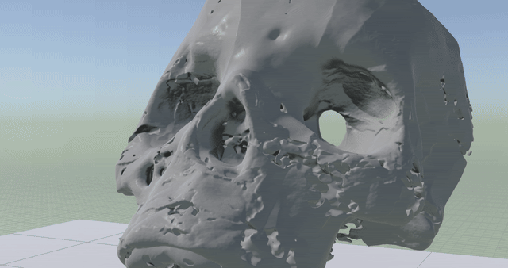</td><td width="50%">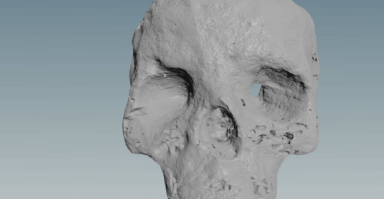</td></tr>
<tr><td>Acid_erosion_FrontCam.mov — GIF playback</td><td>Acid_front_Melt.mov — GIF playback</td></tr>
<tr><td width="50%">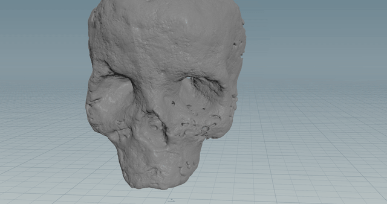</td><td width="50%">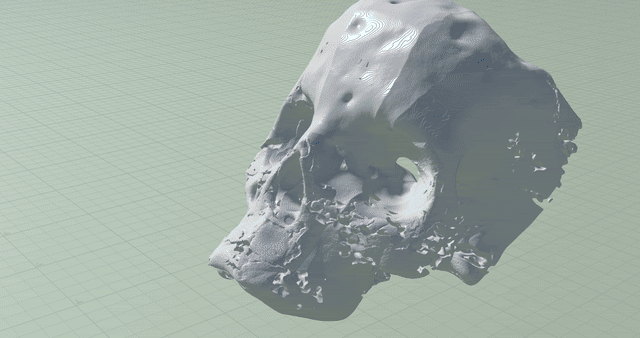</td></tr>
<tr><td>front_Melt_2.mov — GIF playback</td><td>MetalMask_Viscuous.mov — GIF playback</td></tr>
</table>

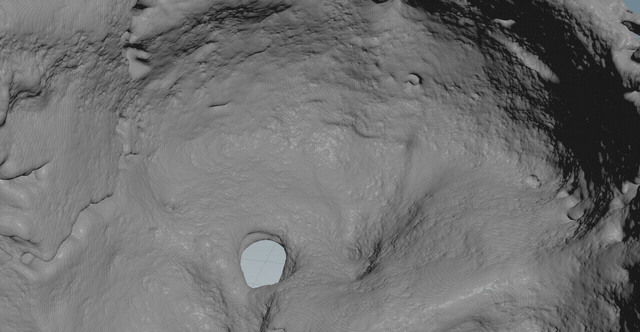

The melt tests shift from a readable face to folds and softened features. The macro view makes the surface breakup visible; the frontal versions let the same problem be judged at portrait scale. These are retained as alternatives, not labeled as a proven sequence of fixes.

[Front melt v1](media/video/front-melt-v1.mp4) · [front melt v2](media/video/front-melt-v2.mp4) · [acid/front melt](media/video/acid-front-melt.mp4) · [macro melt](media/video/macro-melt.mp4) · [acid macro](media/video/acid-macro-melt.mp4)

## 03 / Camera distance and surface breakup

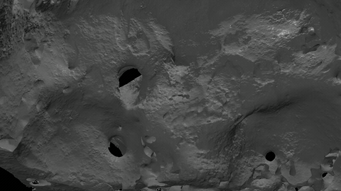

The two numbered playblast sequences inspect the changing surface at different distances. `PB_cam6` contains frames 39–121; `PB_HQ_cam17` contains 39–500, despite the latter files retaining a `PB_cam6_HQ` prefix. Both are preserved at their full available length.

[Camera 6 review](media/video/transformation-cam6.mp4) · [HQ camera 17 review](media/video/transformation-hq-cam17.mp4)

The small `psp0025` and `psp0025_erosionscale07x10` batches are only 11 frames each. They are useful as short surface comparisons, not complete simulations.

[Base fragment](media/video/erosion-psp0025.mp4) · [erosion-scale fragment](media/video/erosion-scale-07x10.mp4)

## 04 / Particles and smoke

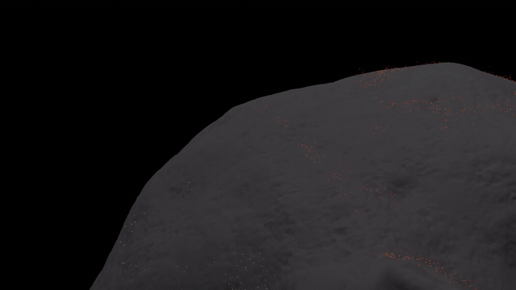

Five dust passes retain the underlying surface while changing the visible particle trace. The red/orange points are easiest to inspect along the upper silhouette. Keeping all five short versions exposes the range of tests without filling the repository with hundreds of almost identical stills.

[v1](media/video/dust-particles-v1.mp4) · [v2](media/video/dust-particles-v2.mp4) · [v3](media/video/dust-particles-v3.mp4) · [v4](media/video/dust-particles-v4.mp4) · [v5](media/video/dust-particles-v5.mp4)

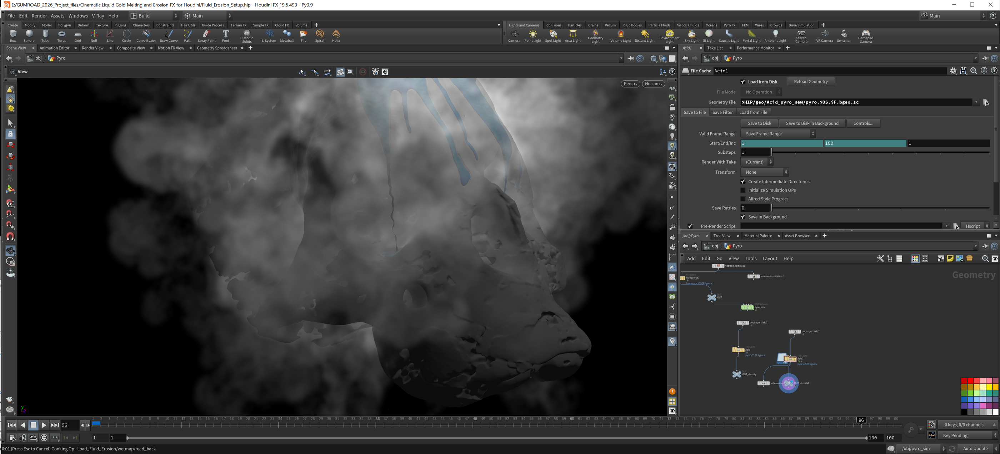

The smoke capture puts the volume in front of the render controls. A separate short gray-geometry test shows smoke at the head’s upper edge. It is a useful visibility check before the dense, dark final composition.

[Smoke test](media/video/acid-smoke-test.mp4)

## 05 / Burning charcoal renders

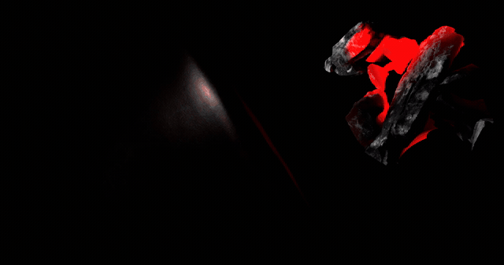

The `SC090 / SH010` renders retain the red interior, broken dark shell and surrounding scene. They are intermediate evidence: darker and less isolated than the final lava views. The complete camera-2 batch has 96 frames; the alternate camera-1 batch stops at frame 16.

[Camera 2 — complete available batch](media/video/lava-render-cam2.mp4) · [camera 1 — 16-frame fragment](media/video/lava-render-cam1-fragment.mp4)

## 06 / Final material and lighting

<table>
<tr><td width="50%">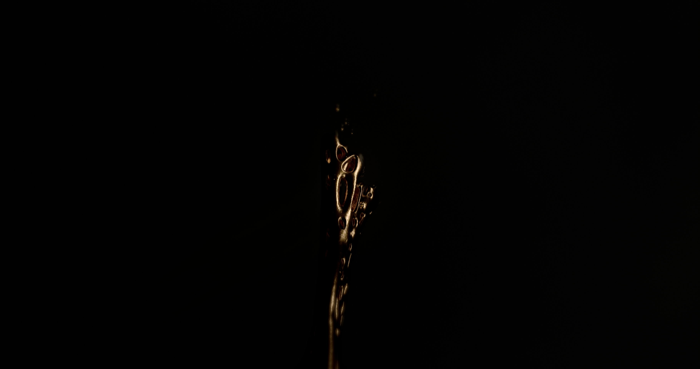</td><td width="50%">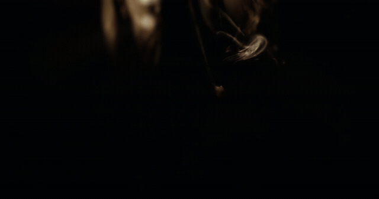</td></tr>
<tr><td width="50%">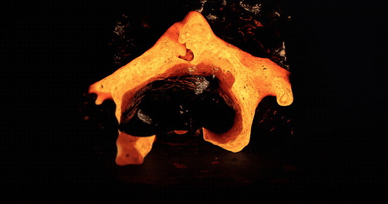</td><td width="50%">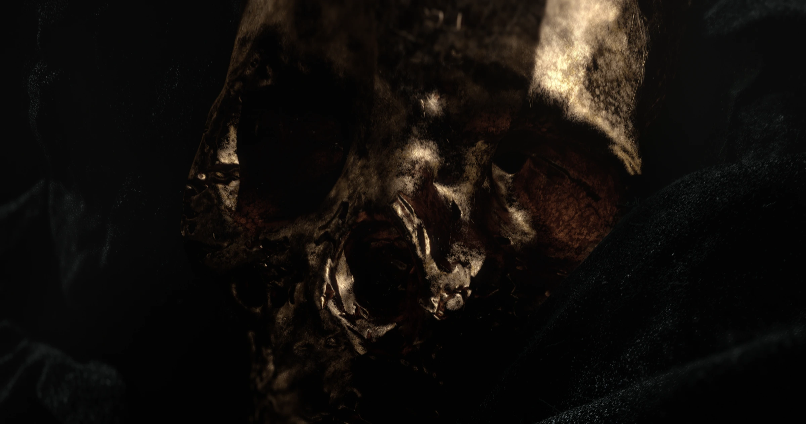</td></tr>
</table>

<table>
<tr><td width="50%">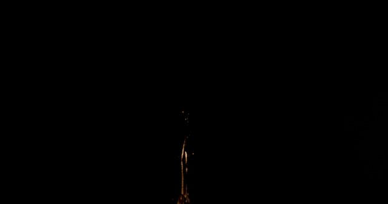</td><td width="50%">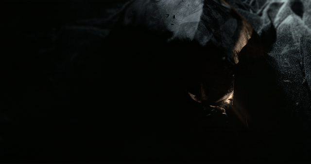</td></tr>
<tr><td>Goldsmith flower closeup — V03</td><td>Goldsmith mask — V06</td></tr>
</table>

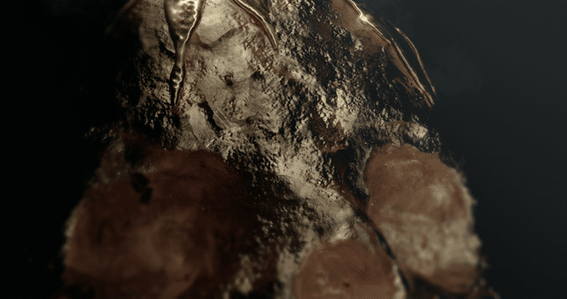

The final treatment uses reflections to describe the gold’s edges, then reverses that relationship in the lava: orange light comes from within a broken black crust. The geometry and diagnostic colors disappear into material, light and framing.

[Gold skull film](media/video/final-gold-skull.mp4) · [liquid gold](media/video/final-liquid-gold.mp4) · [lava front](media/video/final-lava-front.mp4) · [lava profile](media/video/final-lava-profile.mp4)

## Archive notes

- [All media, sizes and provenance](docs/media-index.md)
- [Sequence decisions and audit boundaries](docs/audit-notes.md)
- Original movies retain their source frame rates. New sequence reviews use 24 fps, inferred from adjacent playblasts; this is a review assumption, not recovered scene metadata.
- GIFs are short, lower-resolution previews. Linked MP4s contain the complete selected clips.
- The archive documents visible results and source naming. Solver settings, causal explanations and a strict production chronology are not inferred from filenames alone. No scene files were modified or included.

---

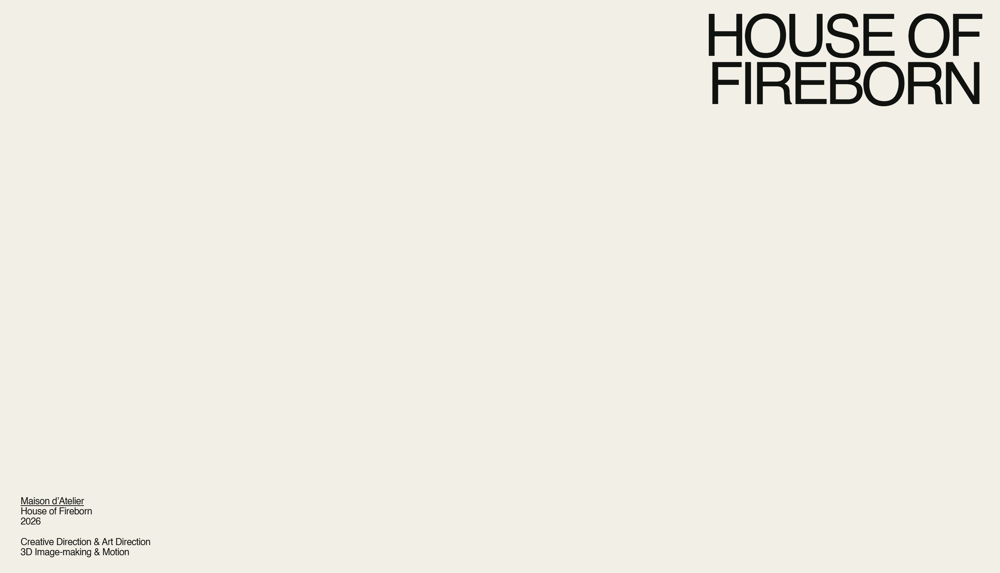

